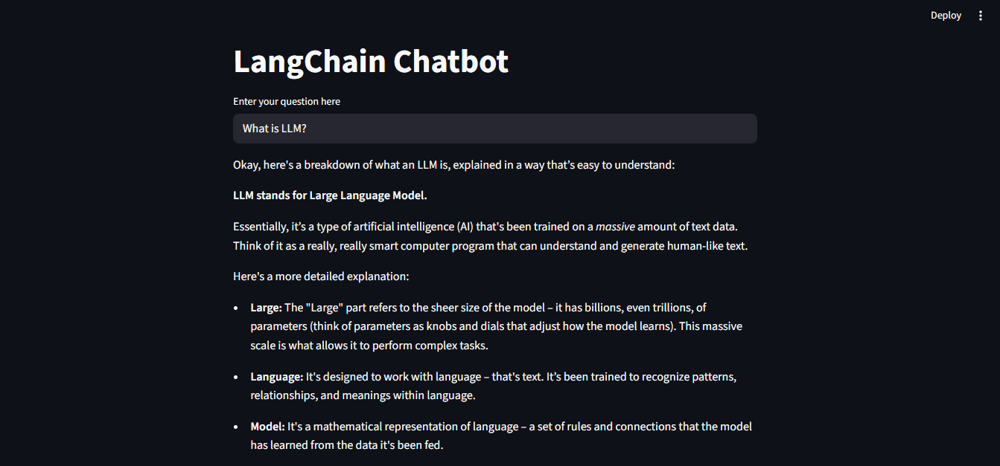
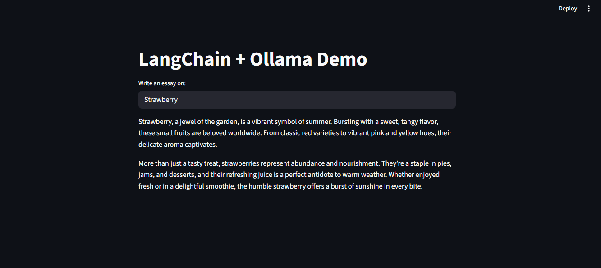
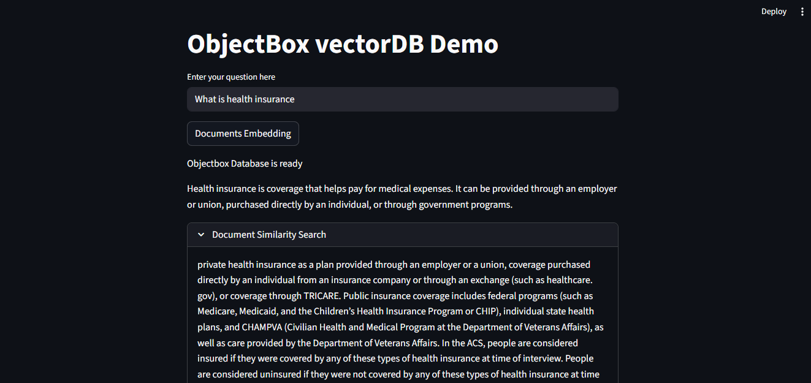

# 🦙 Llamas in the Lab: Exploring the LangChain Ecosystem  

> A hands-on lab exploring the **LangChain ecosystem**, from embeddings and retrievers to chatbots and RAG apps using **Ollama, Hugging Face, Groq, ObjectBox, Chroma, FAISS, LangSmith**, and more.  

This repo is my **learning playground** for GenAI. It includes:  
- **Theory** → Notes on the LangChain ecosystem.  
- **Experiments** → Jupyter notebooks covering embeddings, retrievers, LangSmith, vector DBs, Hugging Face.  
- **Applications** → End-to-end chatbot apps with Ollama, Groq, ObjectBox, FastAPI/Flask backends, and RAG pipelines.  

---

## Understanding the LangChain Ecosystem  

Modern LLM applications rely on multiple components working together. Here’s how they fit:  

### Large Language Models (LLMs)  
- **Ollama** → Run open-source models (LLaMA, Gemma, Mistral) locally.  
- **Groq API** → Cloud inference engine with **ultra-fast latency**.  
- **Hugging Face Hub** → Access to thousands of pretrained LLMs.  

### Vector Databases (Knowledge Store)  
- **FAISS & Chroma** → Lightweight, local vector DBs.  
- **ObjectBox** → On-device vector DB, optimized for mobile/edge.  
- **Pinecone / AstraDB** → Scalable cloud vector stores.  

### LangChain (The Glue)  
- **Chains** → Sequences of steps (e.g., prompt → LLM → parser).  
- **Retrievers** → Fetch relevant chunks from vector DBs.  
- **Agents** → Use tools and reasoning for more complex tasks.  
- **LangSmith** → Debugging & monitoring pipelines.  

### Deployment Options  
- Local scripts (quick prototypes).  
- APIs (Flask/FastAPI for production).  
- Clients (basic Python apps).  
- Cloud / On-device hybrid deployments.  

---

## Experiments (Jupyter Notebooks)  

This repo includes several **notebooks** that explore different parts of the ecosystem:  

- **`agents/agents.ipynb`** → Playing with **LangChain agents** and tool use.  
- **`chain/retriever.ipynb`** → Understanding **retrievers** and document search.  
- **`huggingface/huggingface.ipynb`** → Integrating **Hugging Face models & embeddings** with LangChain.  
- **Embeddings with Chroma & FAISS** → Comparing vector DBs for similarity search.  
- **LangSmith integration** → Tracing and debugging LangChain apps.  
- **Other Colab notebooks (not uploaded yet)** → Covering fine-tuning, multi-modal experiments, and API explorations.  

These experiments form the **foundation** → learning each piece before combining them into apps.  

---

## Applications (End-to-End Apps)  

### 1. Local LLaMA Chatbot  
**File:** `chatbot/localllama.py`  
- **LLM:** Gemma 3 via **Ollama** 
- **Deployment:** Local script, run in terminal.  



---

### 2. API + Client Chatbot  
**Files:** `api/app.py`, `api/client.py`  
- **LLM:** Gemma 3 via **Ollama**  
- **Deployment:** Flask or FastAPI backend with Python client.  

Architecture:  
- Backend (`app.py`) → Exposes FAST API.  
- Client (`client.py`) → Consumes API and provides chat interface.  



---

### 3. Groq-Powered Chatbot  
**File:** `groq/app.py`  
- **LLM:** Gemma 2 (9B) via **Groq API**
- **Deployment:** Local script, queries Groq’s inference engine.  

Why Groq? → **Ultra-low latency inference**, suitable for production chatbots.  


---

### 4. ObjectBox VectorDB RAG Chatbot  
**File:** `objectbox/app.py`  
- **LLM:** Gemma 2 via **Ollama**  
- **Vector DB:** ObjectBox  
- **Deployment:** Local script, runs **RAG pipeline**.  

Workflow:  
1. Documents → embedded & stored in **ObjectBox**.  
2. Retriever fetches relevant chunks.  
3. Ollama (Gemma 2) generates grounded responses.  



---

## Applications in the Real World  

These projects demonstrate patterns used in:  
- **Customer support chatbots** (enterprise Q&A).  
- **Document assistants** (search PDFs, legal docs, knowledge bases).  
- **On-device AI** (privacy-preserving mobile assistants).  
- **Cloud inference + hybrid deployments** (switching between Groq, Ollama, Hugging Face).  
- **Research/learning** (experimenting with multiple vector DBs and providers).  

---

## Setup & Running  

### Requirements & Ecosystem  

- **Python 3.10+** – Recommended runtime environment.  
#### LLM Models  
- [Meta LLaMA](https://ai.meta.com/llama/) – Family of open foundation models from Meta.  
- [OpenAI GPT](https://platform.openai.com/) – Closed-source, API-based models (GPT-3.5, GPT-4, GPT-4o).  
- [Mistral](https://mistral.ai/) – Efficient open-source models (7B, Mixtral, etc.).  
- [Hugging Face Hub](https://huggingface.co/models) – Repository for thousands of open-source models.  
#### Frameworks & Orchestration  
- [LangChain](https://docs.langchain.com/) – Framework for chaining LLM calls, building agents, and production apps.  
- [LlamaIndex](https://docs.llamaindex.ai/) – Data framework to connect LLMs with private/custom data.  
- [LangSmith](https://smith.langchain.com/) – Observability, debugging, and evaluation for LangChain pipelines.  
#### Vector Databases & Retrieval  
- [FAISS](https://github.com/facebookresearch/faiss) – High-performance similarity search library from Meta.  
- [Chroma](https://www.trychroma.com/) – Developer-friendly, local-first embedding store.  
- [ObjectBox Vector DB](https://objectbox.io/) – Lightweight vector database for **on-device** retrieval (mobile/IoT).  
#### Embeddings  
- [Hugging Face Sentence Transformers](https://www.sbert.net/) – Pre-trained embedding models for semantic similarity, clustering, etc.  
- [OpenAI Embeddings](https://platform.openai.com/docs/guides/embeddings) – Embeddings API (e.g., `text-embedding-3-large`) for semantic search & RAG.  
- [Ollama](https://ollama.ai/) – Run and serve open LLMs locally with simple `ollama run <model>` interface.  

Create a Conda environment
```bash
conda create -n llamas python=3.10 -y
conda activate llamas
```

Install dependencies:  
```bash
pip install -r requirements.txt
```

## Author
Built with ♡ by Samima Nasrin.
All experiments, demos, and implementations were created end-to-end by me.


